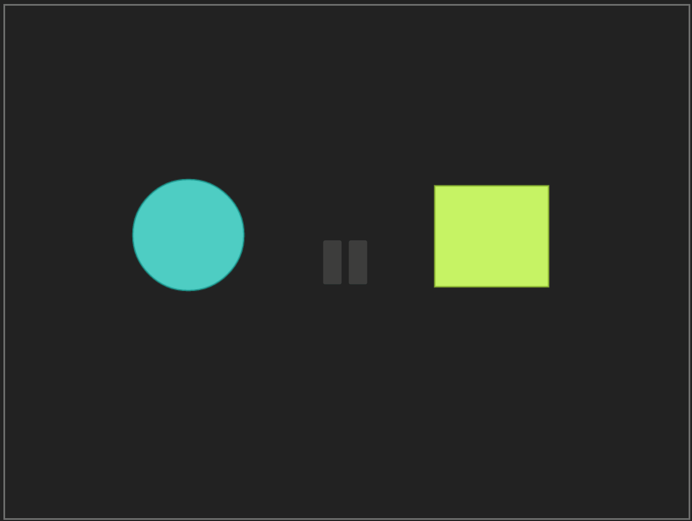
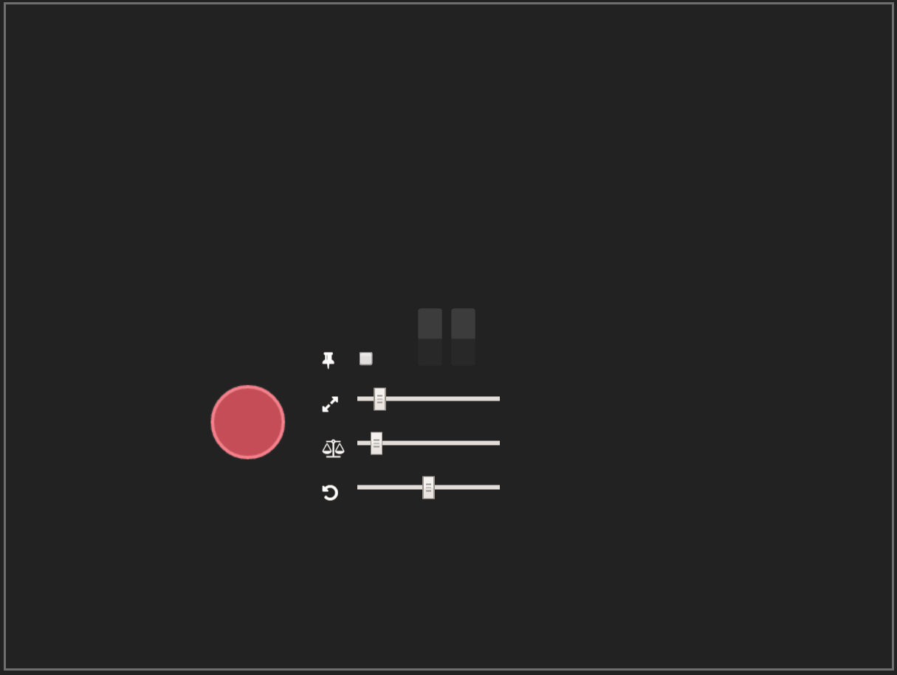
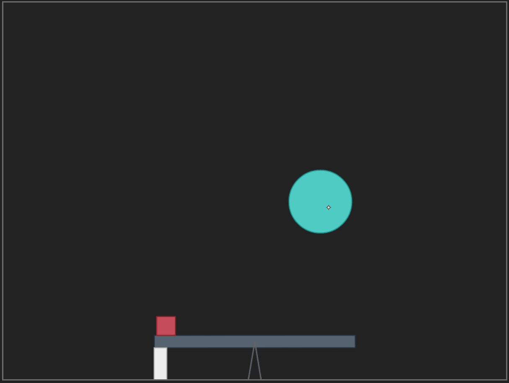
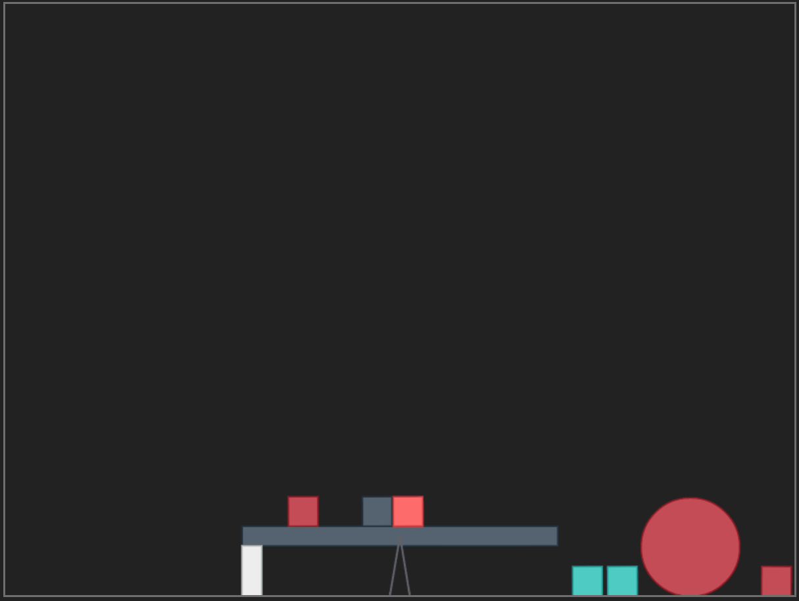

# programmable-matter

programmable-matter allows to draw physics simulations in your browser. To see what it is capable of check out the [demo](http://maxklenk.github.io/programmable-matter/) and have a look at the [feature list](#features).

## Layers

### [$N Multistroke Recognizer](http://depts.washington.edu/aimgroup/proj/dollar/ndollar.html)

To top layer of programmable-matter is a multistroke recognizer we trained to be able to draw Circles, Rectangles and Arrows.
   

### [matter.js](http://brm.io/matter-js/)

The physics simulations take place in matter.js a 2D physics engine with [everything](https://github.com/liabru/matter-js#features) you may need.

### Force Arrows

### Preview

## Features   
   
### Compound Bodies

### Configure Bodies

### Delete Bodies

